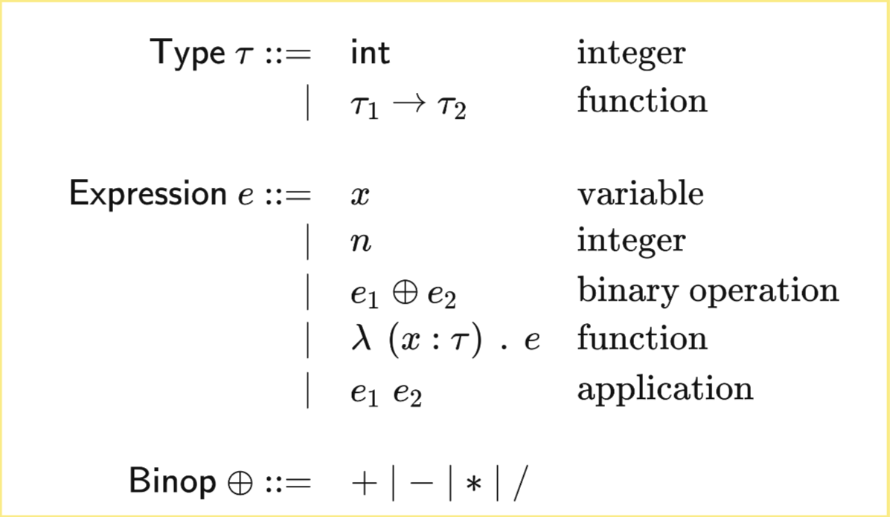
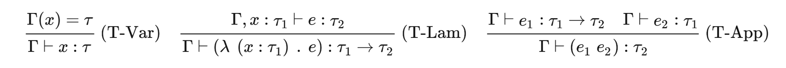
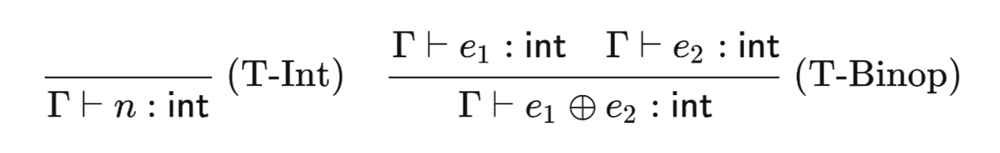
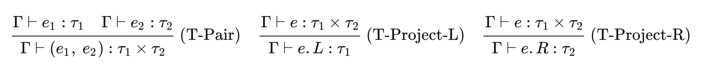
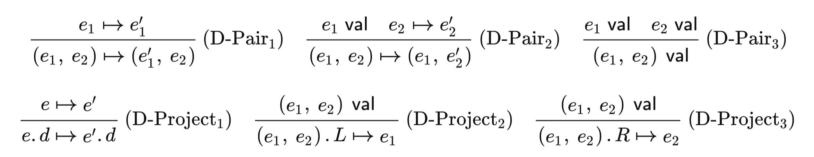
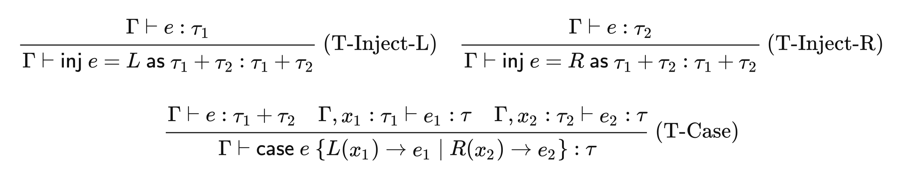
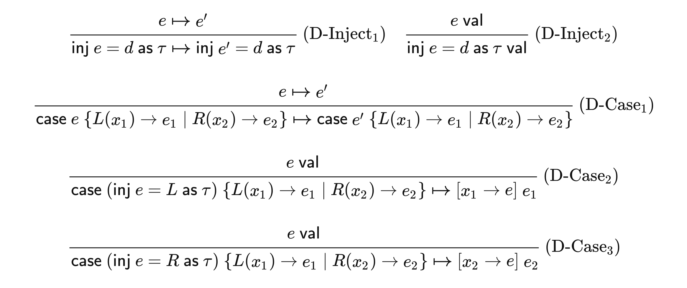

# lambda calculus

本文对应的是 [CS242 Programming Language](https://cs242.stanford.edu) 课程第一、二周的内容。

## 介绍

lambda 表达式是以函数作为基本元素的语言。下面这些都是有效的 lambda 表达式：

```
\x.\x.x
(\x.\y.xy) (\z.z)
```

### 构成

lambda 表达式由变量（variable）、函数声明（function definition）和函数调用（function application）构成：

variable 是单个的变量，通常使用 x, y, z, x', y', z' 等单个字母来表示

function definition 是指形式为 `\x.e` 的 lambda 表达式，包括三个部分：

1. `\`，这个 token 说明之后的 token 是一个 variable
2. `x`，这声明了一个 variable
3. `.`，用来分隔 variable 与之后的表达式
4. `e`，这是一个 lambda 表达式，可以是一个 variable、一个新的 function definition，或者一个 function application。

function application 是指形式为 e1 e2 的 lambda 表达式。

1. e1 可能是一个 function definition 或者一个 function application
2. e2 可能是一个 variable，一个 function definition 或者一个 function application
3. 可以通过括号把 e1 和 e2 间隔开来，比如 `(\x.x) y`

### evaluate

lambda 表达式的 evaluate 是通过变量替换（substitude）完成的，替换操作就是指将其中的某个自由变量全部替换为另一个表达式，比如 `(\x.x) y` evaluate 之后结果为 `y`。

### 一些有趣的 lambda 表达式应用

lambda 表达式看似简单，但是它的表达能力与图灵机等价。比如，可以通过 church encoding 来表达「自然数及其运算」的概念。设定：

```
\f.\x.x = 0
\f.\x.f x = 1
\f.\x.f f x = 2
...
```

简单解释就是，可以通过「应用 f 的次数」来对应自然数。所以，+1 的操作就是 `add_one = \n.\f.\x.f (n f x)`，即「先应用 f n 次，然后再应用 f 1 次」。
两个自然数相加就可以表达为 `plus = \m.\n.\f.\x.(m f)(n f x)`，即「先应用 f n 次，再应用 f m 次」。两个自然数想乘就是 `mul = \m.\n.\f.\x.m (n f) x`，即「设 g = n f，g x 为应用 f n 次，应用 g m 次等于应用 f (m \* n) 次。乘法还可以表达为 `mul2 = \m.\n.\f.\x.m (plus n) (\f.\x.x)`，即「对于 0 执行 + n 操作 m 次）

lambda 表达式还可以表达 boolean 值，如：

```
\a.\b.a = true
\a.\b.b = false
\p.\a.\b.p b a = not
\p.\a.\b.p a b = if
\p1.\p2.\a.\b.p1 (p2 a b) b = and
\p1.\p2.\a.\b.if p1 a (if p2 a b) = or
```

lambda 表达式还可以表达递归，使用不动点组合：

`fixpoint = \f.(\x.f(x x))(\x.f(x x))`

```
fixpoint f = (\x.f(x x))(\x.f(x x))
           = f((\x.f(x x)) (\x.f(x x))
           = f(fixpoint f)

// 一个示例性的调用
sum = fixpoint (\rec.\n.if (iszero n) 0 (plus n (rec (n - 1))))
```

## Typed lambda calculus

上文介绍的 lambda calculus 可能在 eval 过程中出现一些问题：

1. 可能会进入 stuck state，如 `(\x.x) y -> y`
2. function application 的参数数量不一致，如 `(\f.\x.f x x) (\y.y)`

为了解决这类问题，有些语言中提供了 `assert` 方法在运行时报错；而在 lambda 表达式中，可以提供类型系统。扩展后的 lambda calculus 如下：



类型系统的目标是，在不执行的语句的情况下进行类型分析，如果能够导出类型，则说明对应语句是 `well typed` 的。well typed 的语句要么可以继续运行，要么产生一个值。（在 typed lambda calculus 中，这意味着一个 function 或者一个 int）

为了类型系统的正确性，该系统中的每一条类型推断都需要满足以下两个条件：

1. Progress：如果 e 类型为 t，那么要么 e 是一个值，要么存在另一个表达式 e'，e 可以转变为 e'
2. Preservation：如果 e 类型为 t，并且 e 可以转变为 e'，那么 e' 的类型为 t

typed lambda calculus 的类型系统有以下这些分析语法，每条语法的 Progress 与 Preservation 性质证明见[课件](https://cs242.stanford.edu/lectures/02-1-type-systems.html)




### Algebraic data types (ADTs)

还可以进一步扩展出更丰富的类型系统，比如引入 ADTs：

需要新增的 type 包括：

1. void
2. unit
3. t1 \* t2 (product type)
4. t1 + t2 (sum type)

对应的类型推论和 eval 规则如下：






## Interpreter for lambda calculus

可以使用 ocaml 方便地对 typed lambda calculus 进行类型分析以及求值。

（略过 tokenize 和 parse 的过程，假设已经获取到了 ast）

### typecheck

分析类型的方法 typecheck 返回一个 Result<Type>，具体的代码其实就是对上面类型推论的翻译，比如 App 的 typecheck：

```ml
let rec typecheck context e : Result<Type> =
  match e with
  | App (fn, arg) ->
    typecheck context fn
    >>= fun t_fn ->
    typecheck context arg
    >>= fun t_arg ->
    (
      match t_fn with
      | Type.Fn(t_arg', t_out) -> if t_arg = t_arg' then t_out else Error("arg type doesnt match")
      | _ -> Error("fn is not of type Fn")
    )
  (* ...other patterns *)
```

### eval

类似地，实际的求值过程也是翻译之前的规则

```ml
let rec next_step e =
  match e with
  | App(fn, arg) ->
    (
      match fn with
      | Step fn' -> Step(App(fn', arg))
      | Val ->
        (
          match fn with
          | Lam(x, _, body) -> Step(substitude x arg body)
          | _ -> raise RuntimeError("App fn is not Lam")
        )
    )
    (* ...other patterns *)
```
